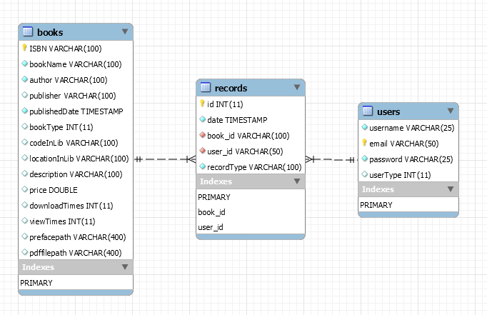
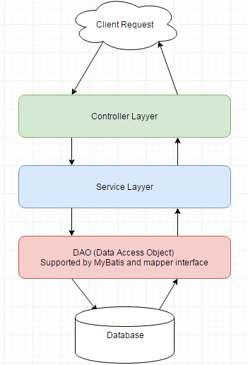

## SIMS (BookOcean, which is a project for learning Java Web Development)

In this project, I used there teachnology which also means that if you read 
all the source code you will be able to learn that all.

* Spring MVC 
* MyBatis 
* MySQL 

-------------

### Demand analysis -- Design first and code later.

First of all, we should know what we are going to do. 
In this project, we want to build a website which support user to upload and download their favorite books.

This system will include different main module.

* Login and Registration Module

   Support all user and traveler to register and login into our website. The website system make sure that 
   the user who trying to login have registed. It will also supply the interface(URL) to logout.

   There will be three different user in this system -- the traveler(un-registed), the normal user(registed)
   and administrator.

   The default privilege of the registed user is `Normal user`. The administrator(Root User) which built in
   with the website when it start to run.

* Book Service Module

   PDF books upload, download, query, modificatioin and delete.

* Record Service Module

  Record used to store the information about who download or upload books.
  Normal users are able to query the records which are related to themselves. No one can access others 
  information except administrator.

  Record module supply the service to generate, query and delete the records.

* User Service Module

  Only open to administrator to create and delete

-------

### Design database table with MySQL script

A book can be used by many people. A user can also have relations with many different books.
So it's clear that the relation between `Book` and `User` is many to many. As the designer,
I used a database table -- `Record` as the middle table to build the connection between 
user and books.

The detail of tables in database shown below there. (With the help of MySQLWorkbench)

There are two `FOREIGN KEY` in the `record table` which store the primary key of the others
two table.

### User `MyBatis` to generate the ORM(Object Relation Mapping) Java files.

After you configured the configure file (configure.xml) of MyBatis, mybatis will help you to 
generate the mapping java class according to the database table. Every table will have it own
java class file and the default interface(Mapper files) to manipulate the database.

The command to run MyBatis:

  java -jar mybatis-generator-core-1.3.2.jar -configfile generator.xml -overwrite

For a building on project, the default mapper files may not be suitable with the change of demand.
You can also learn how to write and modify the mapper files to generate the SQL statements which 
you want.

### URL entrance design

For convenient, I put all URLs which can be accessed by user into java class ` sims.util.URLs`.

The URL construct with different level like:  "/first level/second level/third level/ ... "

If a user want to download a book, the user just send a HTTP request to the URL -- "/books/download/{book-id}"
and the back-end system will start to send a copy of the file to the client.

URL like "/login", "/home", "/users", "/books", "/records" and "/API" in the first level.
Back-end system should be responsible for mapping all bussiness logic with records into URL "/records".
The others service like the same.

I think it's important and helpful to build an management unit for URL in your system.

### Simple login validation with `OncePerRequestFilter`

### Pagination Query

### File upload and Download

### Data binding with Spring MVC

